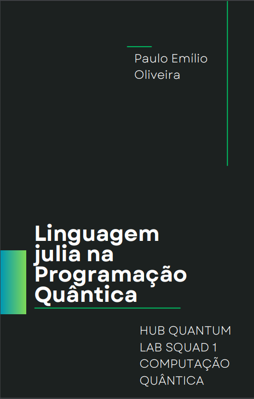

Projeto feito pelo Ânima Hub sobre Computação Quântica. A parte do projeto do meu grupo onde fui líder falamos sobre a Linguagem Julia em relação a Computação Quântica.

Artigo, eBook e Apresentação.

[Apresentação YouTube](https://youtu.be/Et3M-wPef6k)

