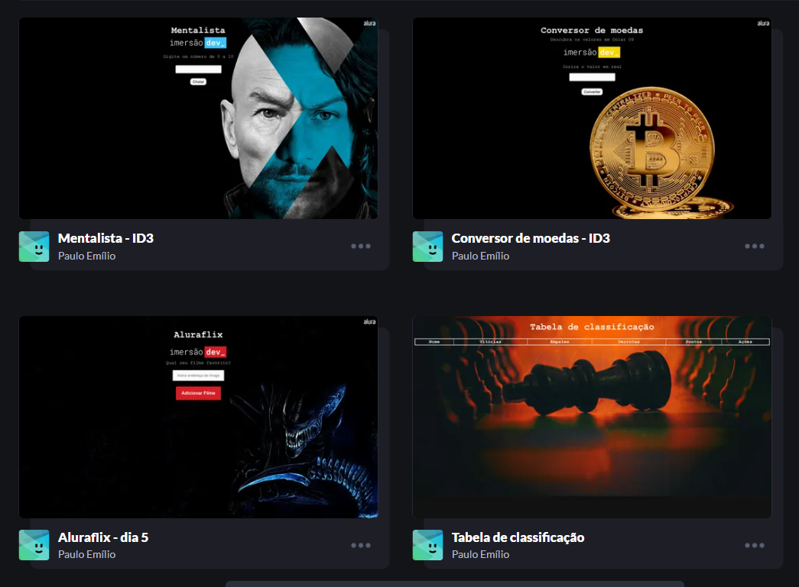
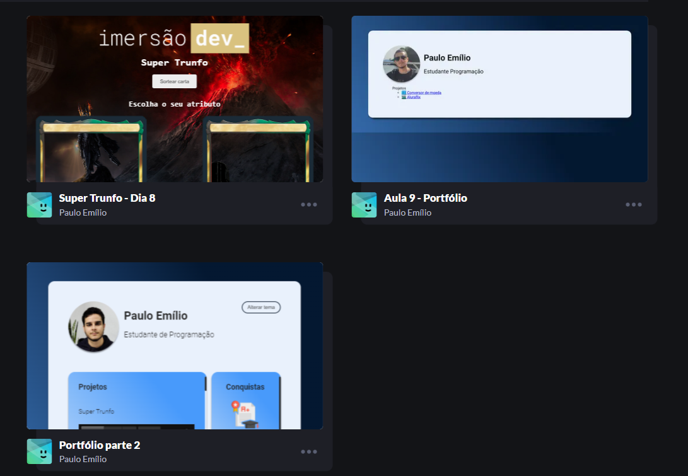

Projeto feito em evento da Alura (Imersão Dev), envolvendo JavaScript, HTML e CSS.

Feito no ambiente CodePen.

Link: [codepen.io/ImersaoDevPauloEmilio](https://codepen.io/collection/zxZvbM?sort_by=id)

